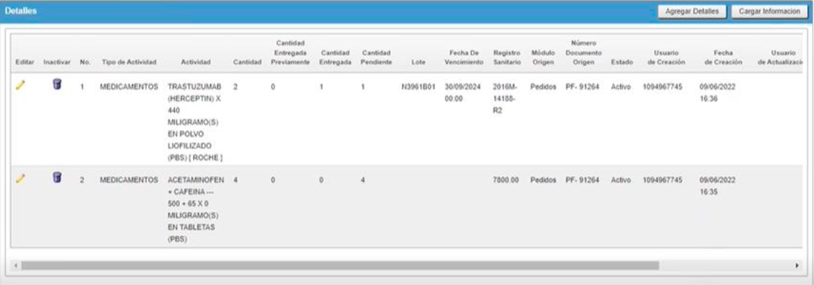
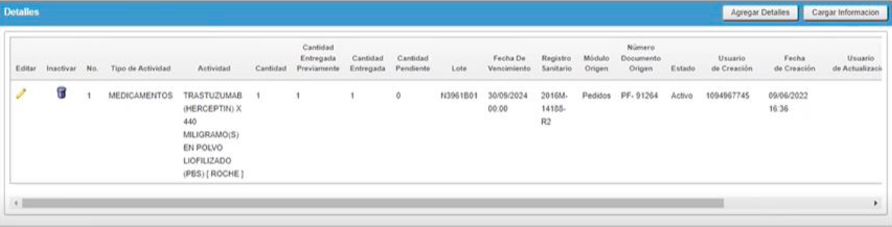

[TOC]

# 1. GENERALIDADES

## 1.1. Introducción

El presente documento tiene como finalidad dar a conocer el consolidado de los cambios realizados al Sistema Integrado de Información en Salud - SIISA.

## 1.2. Definiciones, siglas y abreviaturas

# 2. CARACTERÍSTICAS DEL PRODUCTO

Es un producto multiplataforma disponible para ser instalado sobre los sistemas operativos Windows, Linux, Unix, MacOS y Solaris, el cuál puede ser ejecutado en múltiples navegadores web (google chrome, mozilla firefox, opera, safari), desarrollado sobre el motor de base de datos Oracle Standard Edition con el Framework APEX, utilizando como su principal componente el lenguaje PL/SQL, por medio la herramienta SQL Developer para el ambiente de desarrollo integrado y la administración de la base de datos.

# 3. VERSIONES

## 3.1. Versión 1.47.0.0

### 3.1.1. Descarga de Anexos CAC

En el módulo de Informes de Cuenta de Alto Costo ‘CAC’, al que se puede acceder siguiendo la ruta:  **Inicio > Parametrización > Estadísticas >** **Informes cuenta de alto costo > Reporte de Cáncer** Se habilita al momento de generar la información de la cuenta de alto costo en la pestaña **‘Resultados’**, el botón de **“Exportar Anexos”** mediante el cual se puede realizar la descarga de los anexos del paciente. Estos anexos serán los archivos de multimedia pertenecientes a cada paciente por el que se genere información de la cuenta de alto costo.  

Al momento de presionar el botón **‘Exportar Anexos’**, el sistema realizara la descarga de un archivo comprimido nombrado **“[Fecha Inicio - Fin] - Entidad”** tomando para el nombre los parámetros para la generación de información, dentro de esta carpeta se tendrán subcarpetas nombradas **“[Tipo Identificación + Numero Identificación]”** esto de manera independiente para cada paciente por el que se genera información de la cuenta de alto costo; dentro de estas subcarpetas se tendrán los archivos de multimedia con los que cuente el paciente.

### 3.1.2. Validaciones Configurables Datos Personales

Para el formulario de Datos Personales se agregaron validaciones configurables “CF” para los definir la obligatoriedad de los campos del formulario, a estas validaciones se puede acceder siguiendo la ruta: 

**• Inicio > Parametrización > Pacientes > Validaciones **

Estas validaciones se encontrarán en la región de **‘Validaciones Especificas’**, y se pueden activar o inactivar para que el sistema realice el requerimiento de dichos campos al momento de realizar un registro o una modificación a un paciente.

De los campos del formulario, los siguientes se mantendrán como siempre requeridos y no se puede modificar su propiedad mediante las validaciones configurables: 

o Tipo de Identificación. 

o Número de Identificación. 

o Nombre 1. 

o Apellido 1. 

o Teléfono(s). 

o Entidad.

### 3.1.3. Reporte de Facturación Electrónica

Descripción Para los módulos administrativos de Facturas (Facturas de Venta) y Notas Crédito a los que se accede de acuerdo a la siguiente ruta: 

**• Facturas: Inicio > Administrativo > Facturación > Facturas > Botón Reportes. **

**• Notas Crédito. Inicio > Administrativo > Tesorería > Notas > Notas Crédito > Botón Reportes. **

En estos módulos se agrega una nueva opción de reporte, mediante la cual se puede generar el arte grafico de los registros que son enviados a la DIAN, es decir, mediante estos reportes se puede obtener la factura o la nota crédito que se reporta a la DIAN por parte del proveedor tecnológico sin tener que realizar la búsqueda del registro en el portal que el proveedor haya definido para consultar la información y descargar el arte gráfico del registro. Esta nueva opción solo se mostrará cuando el registro ya se haya reportado a la DIAN electrónicamente, estos registros se pueden identificar cuando en la región visualizar de los módulos en la grilla de información la columna ‘Facturado Electrónicamente’ cuenten con el valor “SI”. 

Adicionalmente, para ambos módulos e incluyendo el módulo de Notas Debito se realiza la misma modificación de la nomenclatura de los botones, ya que se realiza la actualización del nombre del botón ‘Facturación Electrónica’ por **‘Enviar Electrónicamente’**.

### 3.1.4. Integración de Inventarios

Para los módulos de Inventario y su funcionalidad se realizan las siguientes modificaciones: 

**1. Cargar Información:**

En los módulos de Inventarios específicamente para los módulos donde el Tipo de Movimiento es ‘No Aplica’ se tendrá el campo ‘Cargar Desde’ en la región Administrar el cual filtrará por los módulos de los cuales se permita cargar registros o llevar la información a otro registro en el sistema; adicional a eso se tendrá un botón en la región de Detalles llamado ‘Cargar Información’ que al presionarse abrirá una ventana emergente del cual se permita seleccionar el registro a cargar en el módulo teniendo en cuenta lo seleccionado en el campo ‘Cargar Desde’. 

El sistema solo mostrara los registros a cargar cuando estos a nivel de parámetros cuenten con la misma información como la Bodega y (El Proveedor o Paciente) por el que se genera el registro. 

Al momento de seleccionar el registro mediante el **‘Cargar Información’**, el sistema lleva el registro seleccionado como detalle al módulo, lo carga en la grilla e inhabilita los botones de la región Detalles, lo cual impide que se realice el anexo de otro detalle al registro del inventario al que se le cargo de otro módulo el detalle al momento de crearlo; si se requiere agregar otro detalle o modificar el que se cargó, eso se podrá realizar mediante la edición del registro en el módulo. 

Este cambio aplica para los módulos definidos de Ordenes y Pedidos, teniendo en cuenta lo mencionado anteriormente como condición de que el módulo tenga como Tipo de Movimiento el valor de **‘No Aplica’**. 

**2. Control de Pendientes:**

Teniendo en cuenta la funcionalidad de **‘Cargar Información’** donde se puede arrastrar la información entre distintos módulos de inventarios, se incluye la funcionalidad para controlar las actividades y sus cantidades para evitar que en los módulos de inventarios las cantidades superen los valores iniciales o la cantidad de existencia en inventarios. 

Por ejemplo para los módulos de inventarios de Facturas y de Remisiones se aplica esta funcionalidad donde se permite cargar y llevar como detalles actividades con X cantidad y validar que la cantidad a entregar de la actividad no supere la cantidad existente en inventario; en caso de que se dejen actividades con cantidades pendientes el sistema permite que esta actividad se relacione en otro detalle pero lleva como cantidad a entregar la cantidad pendiente que haya quedado de detalles anteriores y valida que la cantidad a entregar del nuevo detalle no supere la cantidad pendiente (Existente en Inventarios) de la actividad. 

**Ejemplos:**

- **Registro 1:**

  **Actividad:** TRASTUZUMAB (HERCEPTIN) X 440 MILIGRAMO(S) EN POLVO LIOFILIZADO (PBS) 

  **Cantidad: 2** | Cantidad Entregada: **1** | Cantidad Pendiente: **1**

- **Registro 2:**

  **Actividad:** TRASTUZUMAB (HERCEPTIN) X 440 MILIGRAMO(S) EN POLVO LIOFILIZADO (PBS) 

  **Cantidad: 1** | Cantidad Entregada: **1** | Cantidad Pendiente: **0** 

## 3.2. Versión 1.48.0.0

### 3.2.1. Parametrización de Servicios

**Inicio > Parametrización > Servicios > Administración de servicios**

Esta actualización permite realizar la selección del servicio en un solo campo de selección nombrado **"Clasificación"**  en el que se encuentran, Estancia, Glucometría, Hemoderivados, imágenes, laboratorios, medicamentos-esquemas, oxigeno, otros, también encontramos un campo de selección nombrado **"Conceptos"**, un campo numérico nombrado **"Nivel de servicio"** y un campo de selección nombrado **"Servicio en consulta"**.

En la ventana **"Visualizar"** el campo de la clasificación se verá reflejado en la columna **"Clasificación"**, en el cual aparecerá el servicio que haya sido seleccionado anteriormente.

 

### 3.2.2. Parametrización de Clasificaciones

**Inicio > Parametrización > Módulos Asistenciales Especializados > Clasificaciones**

Este es un sistema nuevo permite la creación de clasificaciones en el módulo asistencial especializado, agregando campos como, **"Nombre, Abreviación, Color y Modulo Especializado"**, también se encontrará un campo nombrado **"Estado"**, en el cual se verá si el servicio esta activo.

El campo del color es un estilo de clasificación propio que se verá reflejado en el censo.

### 3.2.3. Censo de Módulos Especializados

**Inicio > Asistencial > Censos > (selecciona el censo que solicita consultar)**

En este módulo que nos permite ver los pacientes que se encuentran activos en el sistema en los diferentes servicios de atención del módulo especializado.

Se podrá visualizar información relacionada al paciente como, tipo de identificación, número de identificación, nombre del paciente, entidad aseguradora,entidad pagadora, información de la atención, número de admisión, numero de ingreso, lugar de atención, ubicación, la fecha de ingreso, estancia y el diagnóstico.

**En el módulo se podrán diferenciar los registros por colores según la clasificación realizada en la Parametrización de Clasificaciones.**

### 3.2.4 Registro de Servicios
